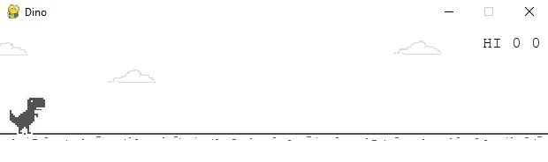
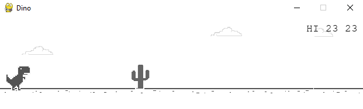
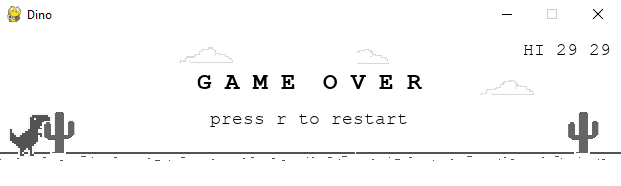

# Game Snapshots

## Snapshot 1 - Start

## Snapshot 2 - Playing

## Snapshot 3 - Game Over

##ps : No search algorithm is used in the dinosaur game. The game's logic primarily involves simple physics-based movement and collision detection, along with a set of rules and heuristics that are designed to create a challenging and engaging gameplay experience.
